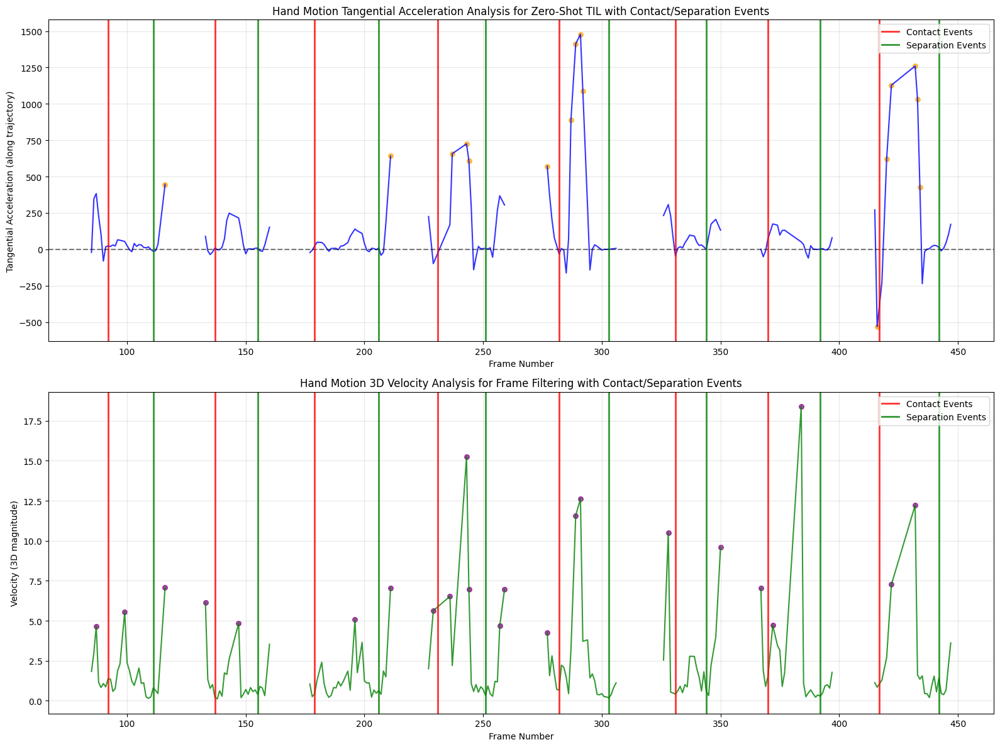

# Zero-Shot Temporal Interaction Localization (TIL) for Egocentric Videos

**Original EgoLoc Authors**: [Erhang Zhang](https://scholar.google.com/citations?user=j1mUqHEAAAAJ&hl=en), [Junyi Ma](https://github.com/BIT-MJY), [Yin-Dong Zheng](https://dblp.org/pid/249/8371.html), [Yixuan Zhou](https://ieeexplore.ieee.org/author/37089460430), [Hesheng Wang](https://scholar.google.com/citations?user=q6AY9XsAAAAJ&hl)

**EgoLoc** is a framework for localizing fine-grained **hand-object contact and separation timestamps** in egocentric videos using physics-informed motion analysis and vision-language model reasoning.

📄 [Read the original paper](https://arxiv.org/abs/2506.03662) – accepted at **IROS 2025**.

---

## Overview

 
 
<i>Egocentric hand-object interaction detection in action.</i>

---

## Core Contribution: Physics-Informed Frame Filtering for TIL

We developed a **physics-informed frame filtering method** that combines two key motion-analysis components to improve temporal interaction localization:

### 1. **3D Hand Velocity Analysis (Percentile-Based)**
- Extract 3D hand velocities from video landmarks to capture approach and retreat motions.
- Apply percentile-based filtering to identify high-motion frames that correlate with interaction events.
- **Z-axis velocity boosting**: The Z-axis (depth-wise motion) is particularly informative for contact/separation detection in egocentric videos, as it directly measures hand approach/retract relative to the camera and object.

### 2. **Tangential Acceleration with Savitzky–Golay Smoothing**
- Compute tangential acceleration: **a_t = (a · v) / |v|** — the component of acceleration along the velocity direction.
- Apply Savitzky–Golay filtering to smooth kinematics while preserving sharp acceleration peaks.
- Use **negative acceleration minima** as cues for hand deceleration (stopping to grasp) and separation events.

### Why This Works
- **Percentile-based velocity** filters frames with significant motion, reducing noise and computational overhead.
- **Tangential acceleration** detects changes in motion magnitude (speeding up / slowing down) along the hand trajectory.
- **Z-axis boosting** highlights approach/retreat behavior most relevant to contact/separation in egocentric viewpoints.
- Together, these pre-inference frame filters improve VLM-based detection accuracy and efficiency.

---

### Visualization: Savitzky–Golay Tangential Acceleration & Boosted Z-Velocity

 
 
<i><b>Top plot:</b> Tangential acceleration (Savitzky–Golay smoothed) showing motion changes along trajectory. 
 <b>Bottom plot:</b> 3D hand velocity with Z-axis boosting, highlighting approach/retreat phases. 
 <b>Red lines:</b> Contact events | <b>Green lines:</b> Separation events</i>

---

## How the Frame Filtering Improves Detection

1. **Pre-inference filtering**: Only high-motion frames (percentile > threshold) are sent to the VLM, reducing redundant inference calls.
2. **Acceleration cues**: Negative tangential acceleration minima act as auxiliary cues for hand stopping behavior (contact preparation).
3. **Depth-aware**: Z-velocity boosting prioritizes depth-wise motion, which is most discriminative in egocentric hand interactions.
4. **Result**: Better pre-localization of contact and separation windows, reducing search space and improving VLM reasoning efficiency.

---

